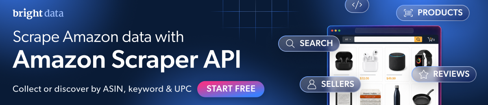

[](https://brightdata.com/products/web-scraper/amazon?utm_source=github)

# amazon-scraper-node

[](https://github.com/brightdata/amazon-scraper-node/actions/workflows/live.yml)
[](https://github.com/brightdata/amazon-scraper-node/actions/workflows/live.yml) <!-- verified: rewritten by the daily run -->

[Quickstart](#quickstart) · [Command](#or-run-it-as-a-command) · [Endpoints](#the-rest-of-the-api) · [Data](#the-data) · [Errors](#when-it-fails) · [Coding agents](#coding-agents) · [Docs](https://docs.brightdata.com/products/scrapers/amazon/introduction) · [Support](#support)

Amazon products, reviews, sellers and search results as JSON, in JavaScript. No
login, no browser. Built on the
[Bright Data Amazon Scraper API](https://brightdata.com/products/web-scraper/amazon?utm_source=github).

Uses the [Bright Data JavaScript SDK](https://github.com/brightdata/sdk-js).
Full API docs:
[Amazon Scraper API](https://docs.brightdata.com/products/scrapers/amazon/introduction).

Also here: a one-command CLI for products, and the
[Bright Data CLI](#coding-agents), which needs no JavaScript at all.

## Quickstart

Node 20 or newer. This package is ESM, so use `import`, not `require`.

```bash
npm install @brightdata/sdk
export BRIGHTDATA_API_TOKEN=YOUR_API_KEY
```

Get a token from the
[Bright Data control panel](https://brightdata.com/cp/setting/users). This SDK
does not read a `.env` file; Node loads one for it with
`node --env-file=.env yourscript.mjs`.

Or skip the token. Run `npx -p @brightdata/cli bdata login` once: it opens a
browser, and from then on the SDK finds the stored credentials on its own, for
you and for any coding agent working in that terminal. Agents cannot click
through the login, so do it yourself first.

No account yet? [Create one](https://brightdata.com/cp/start); new accounts get
[5,000 free credits a month](https://docs.brightdata.com/general/account/billing-and-pricing/free-tier).

```javascript
import { bdclient } from "@brightdata/sdk";

const client = new bdclient({ autoCreateZones: false });
const job = await client.scrape.amazon.collectProducts(
  ["https://www.amazon.com/dp/B0CRMZHDG8"],
  { async: true, includeErrors: true },
);
const result = await job.toResult({ pollTimeout: 600_000 });
if (!result.success) throw new Error(`${result.status}: ${result.error}`);
const [product] = result.data;
console.log(product.title);
console.log(product.final_price, product.currency, "|", product.rating, "stars |", product.reviews_count, "reviews");
await client.close();
```

```
STANLEY Quencher H2.0 Flow State Tumbler, 40 oz, Fuchsia
39.95 USD | 4.7 stars | 205036 reviews
```

One [credit](https://brightdata.com/pricing/web-scraper) per product, and the
API quotes about 7 seconds per input.

Three things in that snippet are not optional.

`autoCreateZones: false` stops the SDK creating zones on startup. The zones are
for Web Unlocker and SERP, two other Bright Data products this scraper never
touches. Creating one fails on accounts without a payment method.

`includeErrors: true` makes the API report a dead ASIN as a row. Without it the
row is dropped and you get nothing.

`async: true` makes `collectProducts` hand back a job rather than going through
the synchronous endpoint, which gives up after a minute.

`pollTimeout` is milliseconds, not seconds. A number copied from a Python
example expires before the first status check.

The SDK's product filter takes `url`, `zipcode` and `language`. The API also
accepts `asin`, `origin_url` and `all_variations`, and the filter rejects all
three, so pass an ASIN as a `/dp/` URL as above.

## Or run it as a command

The command in this repo does the same for several ASINs and writes one JSON
file.

```bash
npm install -g github:brightdata/amazon-scraper-node
amazon-scraper B0CRMZHDG8 B085DVHQ57
```

While this repository is private, that install line works only for people with
access to it.

```
Fetching 2 Amazon products: B0CRMZHDG8, B085DVHQ57
One job for all of them. One credit per product.
asking  2 products...
got     B0CRMZHDG8: 99 fields (STANLEY Quencher H2.0 Flow State Tumbler, 40 oz,)
got     B085DVHQ57: 100 fields (Owala FreeSip Stainless Steel Water Bottle 32 oz)

Saved 2 of 2 products as JSON to amazon.json
```

It takes a product URL just as happily as the ASIN inside it, so
`amazon-scraper https://www.amazon.com/dp/B0CRMZHDG8` does the same thing. The
same ASIN twice is fetched once, so a duplicate costs nothing.

In a terminal the `asking` line is replaced by this, updating in place, so you
can see it is working and how long it has been going:

```
⠹ 2 products 0:00:11
```

```
--out PATH   output file, default amazon.json
```

Every ASIN you ask for goes into one job. The API bills per record, not per
job, so ten products cost the same wait as one.

Import it instead of running it, for `ok` and `error` per ASIN instead of raw
rows. `scrape` never rejects for one bad ASIN; check `ok` before reading
`product`:

```javascript
import { scrape } from "@brightdata/amazon-scraper-node";

for (const outcome of await scrape(["B0CRMZHDG8", "B0ZZZZZZZZ"])) {
  if (outcome.ok) {
    console.log(`${outcome.asin}: ${outcome.product.title}`);
  } else {
    console.log(`${outcome.asin} failed: ${outcome.error}`);
  }
}
```

```
B0CRMZHDG8: STANLEY Quencher H2.0 Flow State Tumbler, 40 oz, Fuchsia
B0ZZZZZZZZ failed: The navigation resulted in a dead page (404 status code)
```

## The rest of the API

The command covers the first row of the table below. Every snippet here is
complete and needs only `@brightdata/sdk`: paste it as is. Every one of them
runs in Actions each Monday, a smaller check runs every other day, and the
badge at the top is the latest result.

| you have | want | call |
| --- | --- | --- |
| an ASIN or product URL | that product | `collectProducts([url], { async: true, includeErrors: true })` |
| a keyword | matching products | `discoverProductsByKeyword([{ keyword }], { async: true, includeErrors: true, limitPerInput: 3 })` |
| a category URL | products in it | `discoverProductsByCategoryURL([{ url }], …)` |
| a best sellers URL | the products on it | `discoverProductsByBestSellerURL([{ category_url }], …)` |
| a UPC | matching products | `discoverProductsByUPC([{ upc }], …)` |
| a seller URL | that seller | `collectSellers([url], { async: true, includeErrors: true })` |
| a keyword and a store URL | a search page | `collectProductSearch([{ keyword, url }], …)` |
| a product URL | its reviews | `collectReviews([url], …)`, one credit per review, and see below |

All of them hang off `client.scrape.amazon`.

### Reviews are not run here, and the reason is money

Reviews bill one credit per review, and there is no working way to ask for
fewer through this SDK.

The API takes a `max_reviews` input, and Bright Data's own documented sample
sets it to 20. The SDK's reviews filter declares only `url` and
`reviews_to_not_include`, and rejects `max_reviews`. The SDK's own cap,
`limitPerInput`, returns zero rows on the reviews dataset, measured three times
across two products, while working normally on products
([sdk-js#37](https://github.com/brightdata/sdk-js/issues/37)).

So the only reviews call that returns anything is the uncapped one. The product
in this README's Quickstart reports 205,036 reviews. That is one call.

Check `reviews_count` on the product first, and until the SDK carries
`max_reviews`, call the REST endpoint directly if you need a bounded slice.

### Caps, and the flag that silently removes them

`limitPerInput` is what bounds a discovery call. It works only when `async: true`
is passed alongside it: without that key the options match the synchronous half
of the SDK's option schema, which drops keys it does not know, and the cap
disappears with no error ([sdk-js#36](https://github.com/brightdata/sdk-js/issues/36)).
The SDK's `DiscoverOptions` type tells you to omit `async`, so the correctly
typed call is the uncapped one.

Every discovery snippet here passes both.

### Products by keyword

```javascript
import { bdclient } from "@brightdata/sdk";

const client = new bdclient({ autoCreateZones: false });
const job = await client.scrape.amazon.discoverProductsByKeyword(
  [{ keyword: "stainless steel water bottle" }],
  { async: true, includeErrors: true, limitPerInput: 3 },
);
const result = await job.toResult({ pollTimeout: 900_000 });
if (!result.success) throw new Error(`${result.status}: ${result.error}`);
for (const product of result.data) {
  console.log(product.asin, "|", product.final_price, product.currency, "|", product.title.slice(0, 40));
}
await client.close();
```

```
B0D2W1MKZX | 14.24 USD | Fijinhom Insulated Water Bottle with Han
B085DVHQ57 | 29.99 USD | Owala FreeSip Stainless Steel Water Bott
B0D8J2ZB8P | 14.24 USD | POWCAN 26 oz Insulated Water Bottle with
```

Without `limitPerInput` that call returns every match, billed one credit each.

### Several products, one job

An array of URLs is one job, not one per product.

```javascript
import { bdclient } from "@brightdata/sdk";

const client = new bdclient({ autoCreateZones: false });
const job = await client.scrape.amazon.collectProducts(
  ["https://www.amazon.com/dp/B0CRMZHDG8", "https://www.amazon.com/dp/B085DVHQ57"],
  { async: true, includeErrors: true },
);
const result = await job.toResult({ pollTimeout: 600_000 });
if (!result.success) throw new Error(`${result.status}: ${result.error}`);
for (const product of result.data) {
  console.log(product.asin, "|", product.brand, "|", product.final_price, product.currency);
}
await client.close();
```

```
B085DVHQ57 | Owala | 29.99 USD
B0CRMZHDG8 | STANLEY | 39.95 USD
```

Rows come back in no guaranteed order. Match them to what you asked for with
each row's own `asin`, not by position.

### Trigger now, fetch later

For anything bigger than a few products, do not block a process for an hour.
Trigger, keep the snapshot id, fetch when ready. Snapshots stay downloadable
for 30 days.

```javascript
import { bdclient } from "@brightdata/sdk";

const client = new bdclient({ autoCreateZones: false });
const job = await client.scrape.amazon.collectProducts(
  ["https://www.amazon.com/dp/B0CRMZHDG8"],
  { async: true, includeErrors: true },
);
console.log("snapshot:", job.snapshotId);
await job.wait({ pollInterval: 5_000, pollTimeout: 600_000 });
console.log("status:", await job.status());
const [record] = await job.fetch();
console.log("fetched:", record.asin, "|", record.title.slice(0, 40));
await client.close();
```

```
snapshot: sd_mu9ycsw7zyq04t1uw
status: ready
fetched: B0CRMZHDG8 | STANLEY Quencher H2.0 Flow State Tumbler
```

## The data

The fields most people want from a product:

```
asin  title  brand  final_price  currency  rating  reviews_count  availability
```

The code hardcodes no field list. Whatever the API returns lands in
`result.data`, and in the command's file.

The API marks 3 of these fields as personal data, with `pii: true` in the
schema: `seller_name`, `zipcode` and `coupon`.

<!-- fields:start -->
<details>
<summary>All 119 fields, with type and description</summary>

Regenerated every day from the dataset schema, via
`client.datasets.amazonProducts.getMetadata()`, so it cannot go stale. A
product carries the fields that apply to it: the sample file has 97
of these 119, plus `timestamp` and `input`,
which the schema does not list.

| field | type | description |
| --- | --- | --- |
| `title` | text | Product title |
| `seller_name` | text | Personal data. Seller name |
| `brand` | text | Product brand |
| `description` | text | A brief description of the product |
| `initial_price` | price | Initial price |
| `currency` | text | Currency of the product |
| `availability` | text | Product availability |
| `reviews_count` | number | Number of reviews |
| `categories` | array | Product categories |
| `parent_asin` | text | Parent ASIN of the product |
| `asin` | text | Unique identifier for each product |
| `buybox_seller` | text | Seller in the buy box |
| `number_of_sellers` | number | Number of sellers for the product |
| `root_bs_rank` | number | Best sellers rank in the general category |
| `ISBN10` | text | ISBN-10 identifier for books |
| `answered_questions` | number | Number of answered questions |
| `domain` | url | URL of the product domain |
| `images_count` | number | Number of images |
| `url` | url | URL that links directly to the product |
| `video_count` | number | Number of videos |
| `image_url` | url | URL that links directly to the product image |
| `item_weight` | text | Weight of the product |
| `rating` | number | Product rating |
| `product_dimensions` | text | Dimensions of the product |
| `seller_id` | text | Unique identifier for each seller |
| `image` | url | URL that links directly to the product image |
| `date_first_available` | text | Date when the product first became available |
| `discount` | text | Product discount information |
| `model_number` | text | Model number of the product |
| `manufacturer` | text | Manufacturer of the product |
| `department` | text | Department to which the product belongs |
| `plus_content` | boolean | Boolean indicating the presence of additional content |
| `upc` | text | Universal Product Code |
| `video` | boolean | Boolean indicating the presence of videos |
| `top_review` | text | Top review for the product |
| `final_price_high` | price | Highest value of the final price when it is a range |
| `final_price` | price | Final price of the product |
| `variations` | array | Details about the same product in different variations |
| `delivery` | array | Delivery-related information |
| `features` | array | Product features |
| `format` | array | Books format-related information |
| `buybox_prices` | object | Product price details |
| `input_asin` | text | Input ASIN (currently inactive) |
| `ingredients` | text | Ingredients of the product, relevant mostly for food products |
| `origin_url` | url | Source page URL used to extract this record |
| `bought_past_month` | number | Units bought in the past month (as shown by Amazon) |
| `is_available` | boolean | Indication if the product is still available |
| `root_bs_category` | text | best seller root category |
| `bs_category` | text | best seller category |
| `bs_rank` | number | best seller rank in the specific category |
| `badge` | text | product badge. for example: #1 Best Seller or Amazons Choice |
| `subcategory_rank` | array | Best Sellers rank entries by subcategory |
| `amazon_choice` | boolean | Specifies if the product is amazons choice |
| `images` | array | URLs of the product images |
| `product_details` | array | Full product details |
| `prices_breakdown` | object | Breakdown of list/typical pricing and deal status |
| `country_of_origin` | text | Country of origin of the product |
| `from_the_brand` | array | Brand-provided promotional media shown on the page |
| `product_description` | array | Media embedded in the product description section |
| `seller_url` | url | Seller storefront/profile URL on Amazon |
| `customer_says` | text | customer_says |
| `sustainability_features` | array | Sustainability badges/certifications with references |
| `climate_pledge_friendly` | boolean | Whether the product shows the Climate Pledge Friendly badge |
| `videos` | array | URLs of the products videos |
| `other_sellers_prices` | array | Offers from other sellers for the same product |
| `downloadable_videos` | array | Direct media URL |
| `editorial_reviews` | array | The Editorial Reviews of the book |
| `about_the_author` | text | About the author information |
| `zipcode` | text | Personal data. ZIP/postal code used for delivery and availability estimates |
| `coupon` | text | Personal data. coupon |
| `sponsered` | boolean | sponsored |
| `store_url` | url | The products store URL |
| `ships_from` | text | Where the item ships from |
| `city` | text | City related to shipping or seller/location context |
| `customers_say` | object | Amazons Customers say summary extracted from reviews |
| `max_quantity_available` | number | Maximum quantity allowed to add to cart |
| `variations_values` | array | Variations and their possible values |
| `language` | text | Language of the product page/content |
| `return_policy` | text | Return policy text shown on the product page |
| `inactive_buy_box` | object | Price information when the Buy Box is unavailable/inactive |
| `buybox_seller_rating` | number | The rating of the buy box seller |
| `premium_brand` | boolean | Is it premium brand |
| `amazon_prime` | boolean | Does it have amazon prime delivery |
| `coupon_description` | text | coupon description |
| `all_badges` | array | all badges |
| `sponsored` | boolean | Amazon Sponsored flag |
| `variant_id` | text | Unique identifier for the specific variant |
| `product_category` | text | Full breadcrumb path joined with separator |
| `category_tree` | array | Category hierarchy as array of objects with name and url |
| `availability_date` | text | Expected availability date for out-of-stock items |
| `listing_has_variations` | boolean | Whether the listing has multiple variants |
| `variant_attributes` | array | Current variant attributes as name/value pairs |
| `variants` | array | Structured variant options grouped by type |
| `seller_privacy_policy` | text | URL to seller privacy policy |
| `seller_tos` | text | URL to seller terms of service |
| `return_window` | number | Number of days for return window |
| `target_countries` | array | Countries where product ships to |
| `store_country` | text | store_country |
| `category_urls` | array | category breadcrumbs |
| `all_variations` | boolean | nput field for collecting all variations |
| `safety_information` | text | Safety Information |
| `subcategory_link` | array | Best Sellers link entries by subcategory |
| `all_inactive_buy_box` | array | all inactive buy box information |
| `is_frequently_returned_item_badge` | boolean | Indicates whether the badge is present |
| `frequently_returned_item_message` | text | The text shown inside the warning box |
| `is_customers_usually_keep` | boolean | Indicates whether customers usually keep this item |
| `title_badge` | text | Title of the badge |
| `review_images` | array | review_images |
| `review_videos` | array | review_videos |
| `also_viewed` | array | Customers also viewed |
| `similar_items` | array | Consider a similar item |
| `bought_past_month_text` | text | Units bought in the past month (as displayed by Amazon), in text format. |
| `is_high_price` | boolean | Indicates whether the product is tagged as high price. |
| `title_highlight` | text | Captures the supplementary marketing/highlight text that Amazon renders directly after the product title on the product page |
| `title_clean` | text | The actual product title as defined by the seller/brand, excluding any Amazon-rendered highlight text that may appear next to/after it on the page |
| `customers_say_topics` | array | Structured breakdown of the "Customers say" section |
| `brand_url` | url | Product brand URL |
| `variant_condition` | text | The condition of a product variant (e.g., New, Renewed, Refurbished - Excellent). |
| `is_aplus_premium` | boolean | Indicates whether the product is Premium A+ |

</details>
<!-- fields:end -->

<details>
<summary>The start of a real output file, from <code>amazon-scraper B0CRMZHDG8</code></summary>

```json
{
  "generated_at": "2026-09-20T15:10:50.120Z",
  "products": [
    {
      "asin": "B0CRMZHDG8",
      "product": {
        "title": "STANLEY Quencher H2.0 Flow State Tumbler, 40 oz, Fuchsia",
        "seller_name": "Avrix Brands",
        "brand": "STANLEY",
        "description": "Constructed of recycled stainless steel for sustainable sipping, our 40 oz Quencher H2.0 offers maximum hydration with fewer refills. Commuting, studio workouts, day trips or your front porch—you’ll want this tumbler by your side. Thanks to Stanley’s vacuum insulation, your water will stay ice-cold, hour after hour. The advanced FlowState™ lid features a rotating cover with three positions: a straw opening designed to resist splashes while holding the reusable straw in place, a drink opening, and a full-cover top. The ergonomic handle includes comfort-grip inserts for easy carrying, and the narrow base fits just about any car cup holder.",
        "initial_price": 45,
        "currency": "USD",
        "availability": "In Stock",
        "reviews_count": 205036,
        "categories": [
          "Home & Kitchen",
          "Kitchen & Dining",
          "Storage & Organization",
          "Thermoses",
  ...
```

The whole file, one product with every field, is
[examples/sample_output.json](examples/sample_output.json).

</details>

## When it fails

| you see | what it means |
| --- | --- |
| `API token required but not found.` | Exit 2, before any request. Set the token. |
| `failed  ASIN: ...` | Exit 1. No such product, usually a typo in the ASIN. |
| `failed  ASIN: the API returned no row for this ASIN` | Exit 1. The job came back without a row for that input. Run it again. |
| `failed  ASIN: Polling timed out after 605s for sd_...` | Exit 1. A request gives up after 600 seconds. Run it again. |

Any failure exits 1, so a run is safe to gate a script on.

From the SDK, the same conditions look like this:

| you see | what it means |
| --- | --- |
| `AuthenticationError: No API token found.` | No token anywhere: not in the options, the environment, or the CLI login. |
| `APIError` with status 401 | The token is set but wrong. |
| `result.success` is `false`, `result.status` is `"timeout"` | The SDK gave up waiting. Raise `pollTimeout`, in milliseconds, or run it again. |
| a row in `result.data` with an `error` key | The API's answer for one input, when you asked for `includeErrors`. The other rows are fine. |
| a successful result with zero rows | On the reviews dataset, that is `limitPerInput`. Remove it, and mind the bill. |

## Coding agents

No JavaScript, nothing installed. Paste both lines; the first opens a browser
once, or use `bdata login --device` over SSH and in CI:

```bash
npx -p @brightdata/cli bdata login
npx -p @brightdata/cli bdata pipelines amazon_product "https://www.amazon.com/dp/B0CRMZHDG8"
```

`bdata pipelines list` prints every type. The Amazon ones are `amazon_product`,
`amazon_product_reviews` and `amazon_product_search`. Each takes URLs, prints
JSON, and costs one credit per record.

`npx skills add brightdata/skills` teaches Claude Code, Cursor and Codex these
commands and the docs, so plain language works afterwards. Full guide:
[Bright Data for your coding agent](https://docs.brightdata.com/quickstart-coding-agent).

No terminal, for a hosted assistant? The
[Bright Data MCP server](https://github.com/brightdata/brightdata-mcp#which-tool-to-use)
has Amazon tools in its `ecommerce` group, which is off unless you ask for it:

    https://mcp.brightdata.com/mcp?token=YOUR_API_TOKEN&groups=ecommerce

An agent can also open the account itself, no signup form:
[agent registration](https://brightdata.com/auth.md). Everything else Bright
Data connects to, from LangChain to Zapier and n8n:
[integrations](https://docs.brightdata.com/integrations/introduction).

## Support

Bugs in this repo:
[open an issue](https://github.com/brightdata/amazon-scraper-node/issues).
Anything about the API, your account or your credits:
[Bright Data support](https://brightdata.zendesk.com/hc/en-us/requests/new).

## License

MIT.
